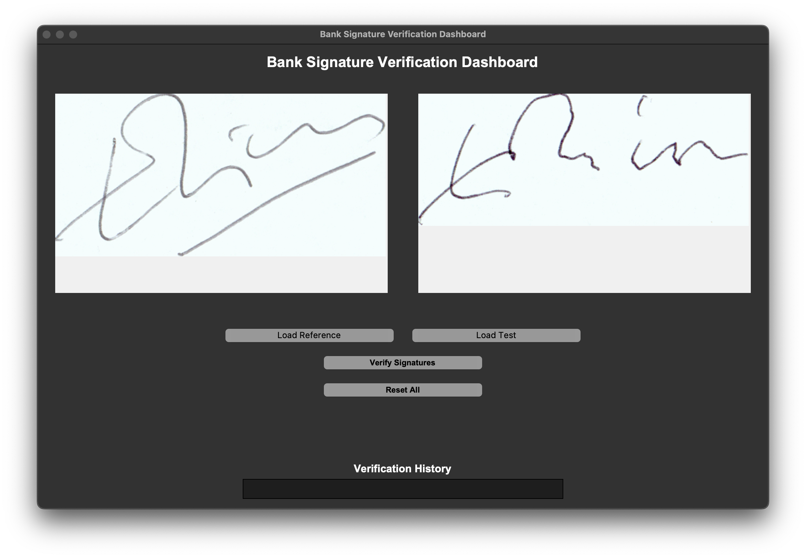
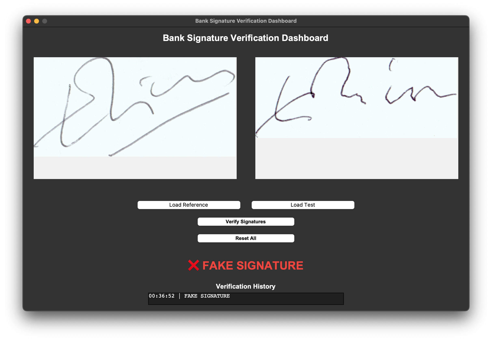

# ✍️ Signature Verification with Siamese Network

This project implements a **signature verification system** using a **Siamese neural network**.  
The system compares two signatures and determines whether they belong to the same person (**genuine**) or not (**forged**).

---

---

---

## 🚀 Features
- Pre-trained Siamese model for signature verification (`models` or `.pt`).
- REST API built with **FastAPI** for easy integration.
- GUI built with **Tkinter** for desktop usage.
- Supports real-time signature verification.
- Adjustable decision threshold.

---

## 📂 Project Structure
```
├── models            # Trained Siamese model (TensorFlow/Keras)
├── main.py                  # FastAPI server (signature verification endpoint)
├── app.py                  # Tkinter-based GUI application
├── requirements.txt        # Python dependencies
└── README.md               # Project documentation
```

---

## ⚙️ Installation

### 1. Clone the repository
```bash
git clone https://github.com/thpunisher/verify_signature.git
cd verify_signature
```

### 2. Create virtual environment (recommended)
```bash
python3 -m venv venv
source venv/bin/activate   # macOS/Linux
venv\Scripts\activate      # Windows
```

### 3. Install dependencies
```bash
pip install -r requirements.txt
```

---

## 🧠 Model Training
You can either:
1. Train the Siamese model using the Kaggle notebook:  
   [Signature Verification Siamese](https://www.kaggle.com/code/samhithary/signature-verification-siamese)  
2. Or download the pre-trained model (`models`) and place it in the project root.

---

## ▶️ Usage

### 1. Run API with FastAPI
```bash
uvicorn app:app --reload
```
API available at:  
👉 `http://127.0.0.1:8000/docs`

**POST /verify**  
- `file_ref`: Reference signature (image)  
- `file_test`: Test signature (image)  

Response:
```json
{
  "distance": 0.12,
  "decision": "genuine"
}
```

---

### 2. Run GUI
```bash
python gui.py
```
- Upload two signatures.  
- Preview them in a larger window.  
- Result will show **"Original"** or **"Fake"**.

---

## 📊 Example Results
| Reference Signature | Test Signature | Decision  |
|---------------------|----------------|-----------|
|  |  | ✅ Genuine |
|  |  | ⌠Forged |

---

## 🛠 Tech Stack
- **Python**
- **TensorFlow/Keras** – Siamese neural network
- **FastAPI** – REST API
- **Tkinter** – Desktop GUI
- **OpenCV & Pillow** – Image processing

---

## 📌 Future Improvements
- Deploy API with Docker
- Add web-based UI (Next.js or Streamlit)
- Improve threshold calibration with ROC analysis

---

## 👨‍💻 Author
Developed by [Thpunisher] 🚀  
Feel free to contribute or fork the project!
